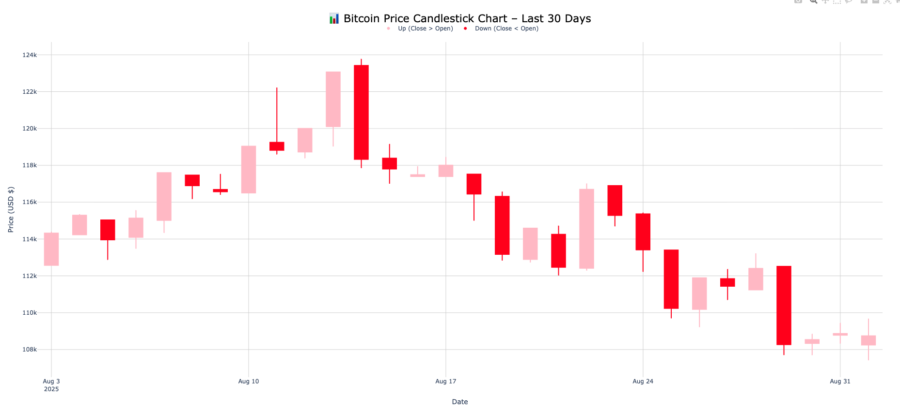

# 📊 Bitcoin Candlestick Chart (30 Days)

This project fetches the past 30 days of **Bitcoin price data** using the [CoinGecko API](https://www.coingecko.com/en/api), processes it with **pandas**, and visualizes it as a candlestick chart using **Plotly**.

---

## 🚀 Features
- Fetches **live Bitcoin market data** (USD) via the CoinGecko API  
- Groups raw price data into **daily OHLC (Open, High, Low, Close)** values  
- Renders an interactive **candlestick chart** with:
  - Pink candles for **up days** (close > open)  
  - Red candles for **down days** (close < open)  
  - Clean white background and gridlines  
  - A legend explaining candle colors  

---

## 🛠️ Requirements
Install the required libraries inside your virtual environment:

```bash
pip install pycoingecko pandas plotly

📷 Example Output

Here’s a preview of the chart:



📖 Notes

The chart uses candlestick coloring:

Pink → Bitcoin closed higher than it opened (up day)

Red → Bitcoin closed lower than it opened (down day)

Data updates every time you run the script, as it pulls live prices from CoinGecko.


📌 Possible improvements:

 Moving average (7-day, 30-day) overlays

Allowwing user to select different coins (Ethereum, Dogecoin, etc.)

Saving the chart to HTML for easy sharing


This project is for educational purposes as part of me practicing my Python, pandas, and Plotly skills.